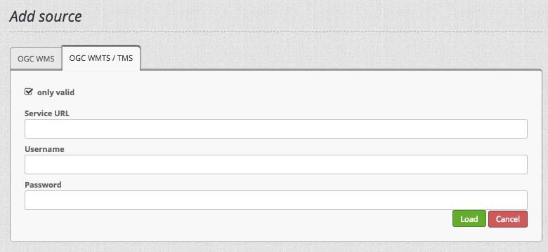
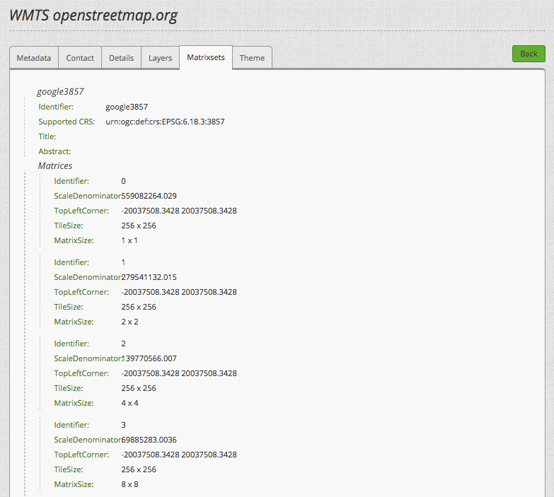
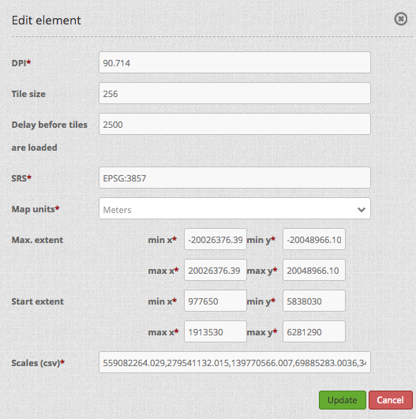
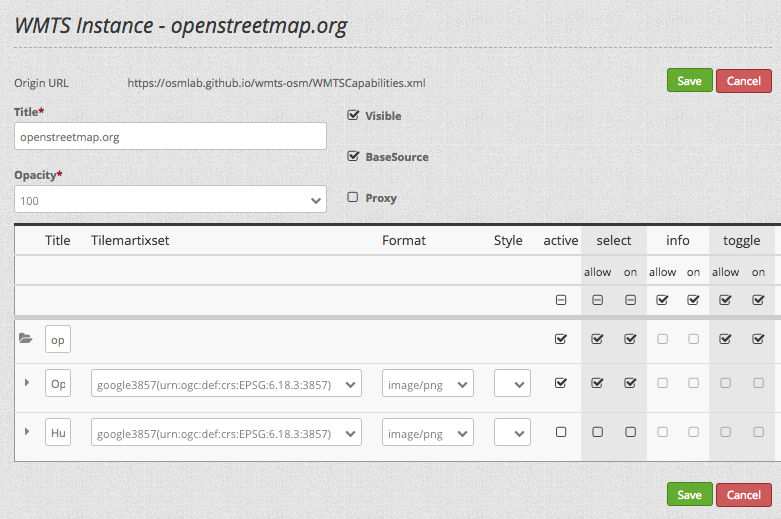

# Description

This is the WmtsBundle that was originally created for the HRO project. It was adapted to work with Mapbender v3.0.6 (v3.0.7 respectively).

## Installation

**Clean mapbender-starter**

* clone the WmtsBundle into mapbender directory

```bash
cd application/mapbender/src
git clone git@repo.wheregroup.com:ckuntzsch/WmtsBundle.git
```

**Project specific installation**

* clone the WmtsBundle into project directory

```bash
cd application/src/Mapbender
git clone git@repo.wheregroup.com:ckuntzsch/WmtsBundle.git
```

* add WmtsBundle to `routing.yml` and `AppKernel.php`

```bash
cd application/app/config
vi routing.yml
```

```yml
#...
    
mapbender_wmtsbundle:
    resource: "@MapbenderWmtsBundle/Controller/"
    type: annotation

#...
```

```bash
cd application/app
vi AppKernel.php
```

```php
// Mapbender3 bundles
//...
new Mapbender\WmtsBundle\MapbenderWmtsBundle(),
//...
```

* update database schema

```bash
cd application
app/console doctrine:schema:update --force
```

## Configuration

### Add source

A WMTS or TMS service can be added to mapbender like any other web map service. Choose the **OGC WMTS / TMS** tab from the *Add Source* menu and enter a valid *GetCapabilities*-URL.



After adding the WMTS/TMS source, view its metadata and go to **Matrixsets** and click on *Matrices*. This will display the service's specific information on scale, size and extent of each zoom level. Especially the parameter *ScaleDenominator* is important, as it represents the valid scale levels for your map appliation.



### Configure the map element

If your application uses a WMTS or TMS, your map element has to be specifically configured for this service. The following configuration assumes the service to use the *Google Web Mercator* or *Pseudo Mercator* coordinate system ([EPSG:3857](https://epsg.io/3857)).

* DPI: `90.714`
* Tile Size: `256`
* SRS: `EPSG:3857`
* Max. extent:
    * min x: `-20026376.39`
    * min y: `-20048966.10`
    * max x: `20026376.39`
    * max y: `20048966.10`
Scales (csv): `559082264.029,279541132.015,139770566.007,69885283.0036,34942641.5018,17471320.7509,8735660.37545,4367830.187725,2183915.09386,1091957.54693,545978.773466,272989.386733,136494.693366,68247.3466832,34123.6733416,17061.8366708,8530.9183354,4265.4591677,2132.72958385,1066.36479193,533.18239597`
Other SRS: **Important** none.



It is important to note, that your map element should be configured to use the same SRS as the service does. Switching to other SRS will result in either a broken map element or misaligned map tiles.

### Add WMTS/TMS to layerset

Just like a WMS, a WMTS/TMS can be added to a layerset. Please note that for now, you can only ever activate one layer from a WMTS/TMS source. If you want to add multiple layers from one source, you need to add more instances to your layerset.

